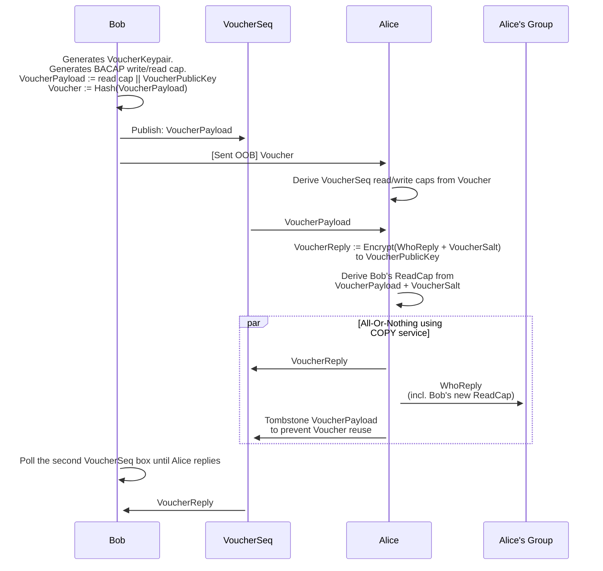

# Contact vouchers

In order to join or initiate a conversation, participants need to exchange cryptographic key material.
To address this problem we have a slightly unusual design: Contact vouchers.

In many systems, invites to conversations flow from an existing member of the conversation to the user being invited.
In our "Contact Voucher" protocol this flow is reversed:
A member wishing to join a conversation hands a "Contact Voucher" (out of band) to the existing member, who then inducts the new member into the group.

This design mitigates two potential problem with the former way of doing it:
1. If the Contact Voucher is observed by a third-party, the third-party does not get to read neither participants' actual messages.
   - **Passive** adversaries learn that the voucher was spent, but do not get to observe further interactions.
   - **Active** adversaries can create a new fake group to induct the member into but does not learn anything about the existing group.
     - In the future to prevent this one-way impersonation we could allow a "both parties bring something on paper to the meeting":
       - Bob brings Contact Voucher
       - Alice brings fingerprint for the VoucherReplyPublicKey (thwarts the active attacker)
2. Only one thing needs to delivered out of band to achieve a 2-pass protocol (instead of a 3-pass protocol).
  - Only one of the parties need to bring key material to a meeting in order to establish contact.

## Self-authenticating BACAP payload
The first message sent (The VoucherPayload) is authenticated in the following manner:
- The VoucherPayload is computed (first).
- A cryptographic hash of the VoucherPayload is computed. This hash **is** the *Voucher**.
- The **Voucher** is then used to derive a BACAP read/write capability set.
- The VoucherPayload is uploaded to the sequence described by the capability (at index 0).
- Anyone who intercepts the **Voucher** can read **and** write the sequence.
- But: Since the **Voucher** is a hash over the VoucherPayload, writing the sequence with anything but the VoucherPayload will be detectable by the recipient.
- This means that the contents *cannot* be undetectably be modified by the interceptor.

